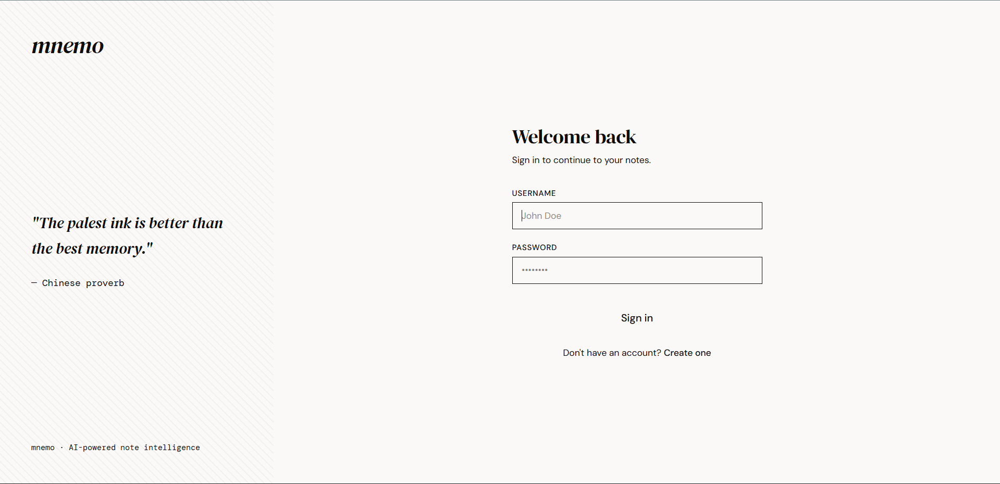
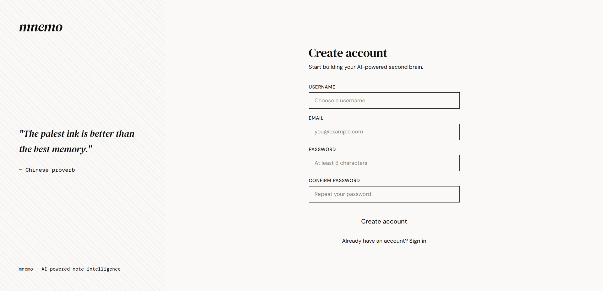
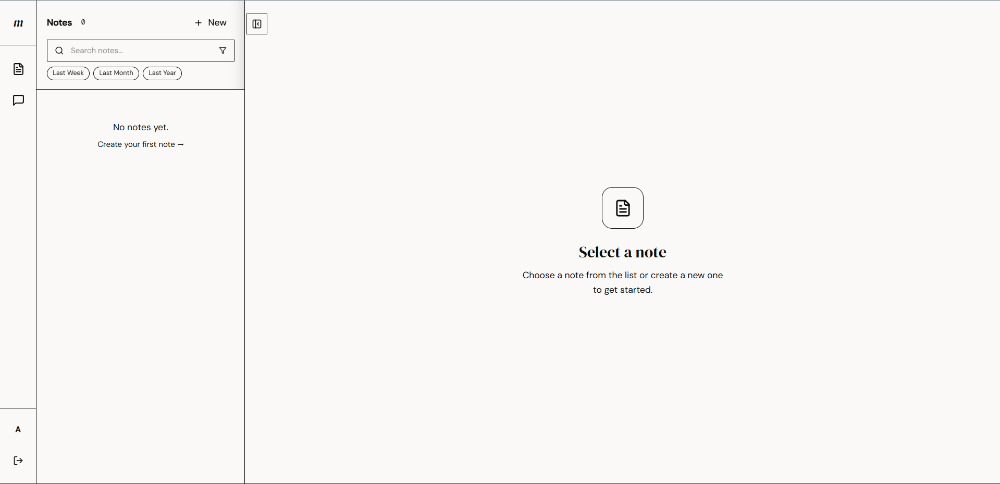
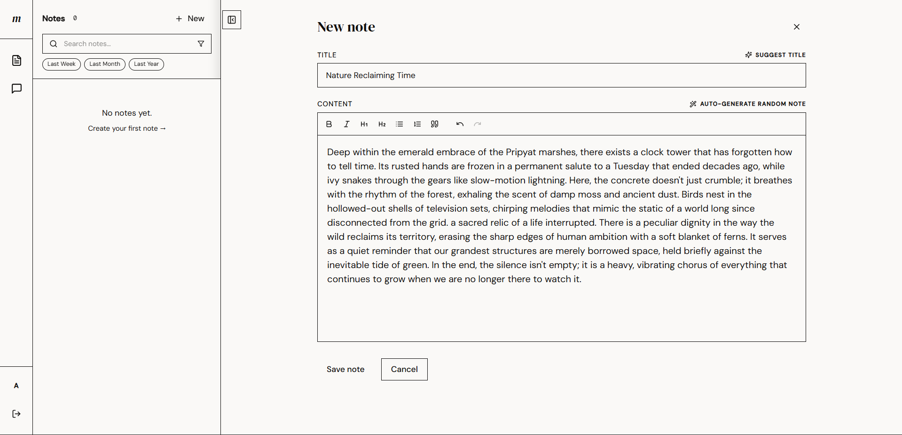
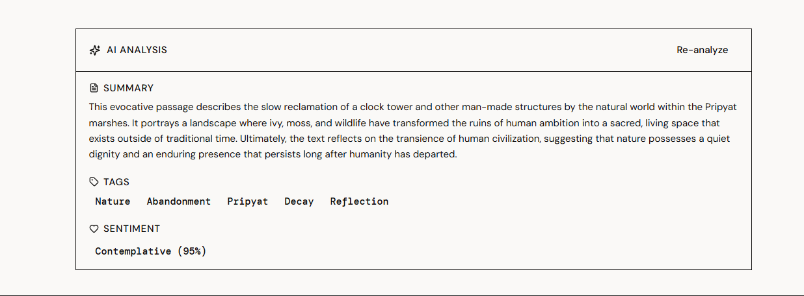
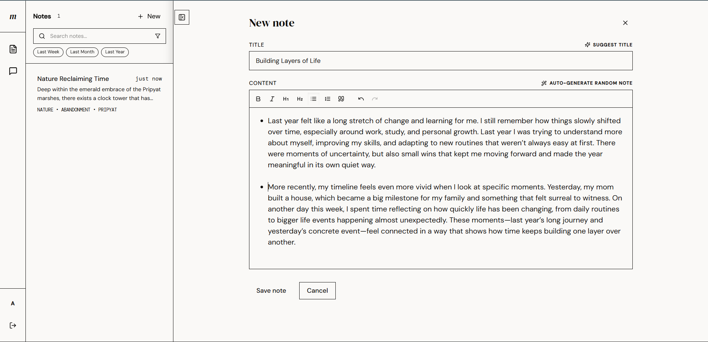
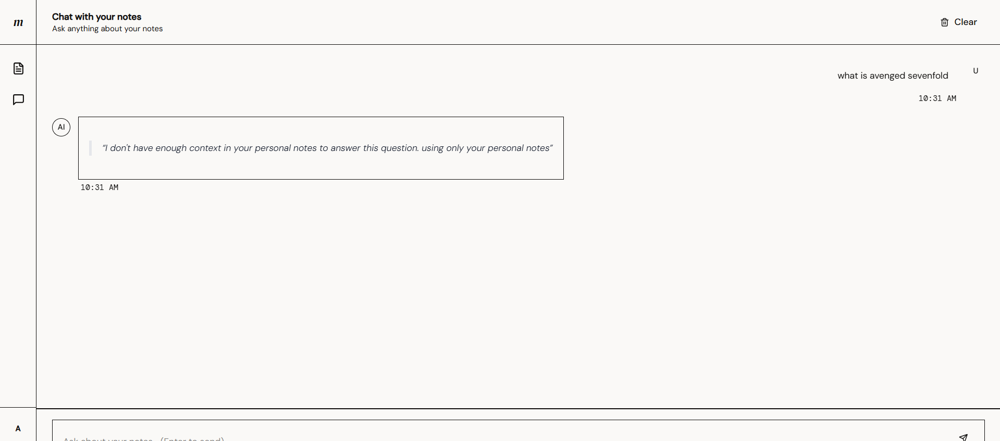
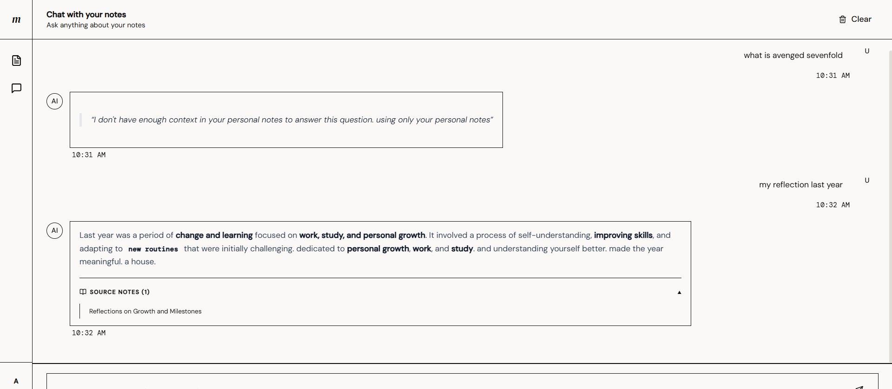
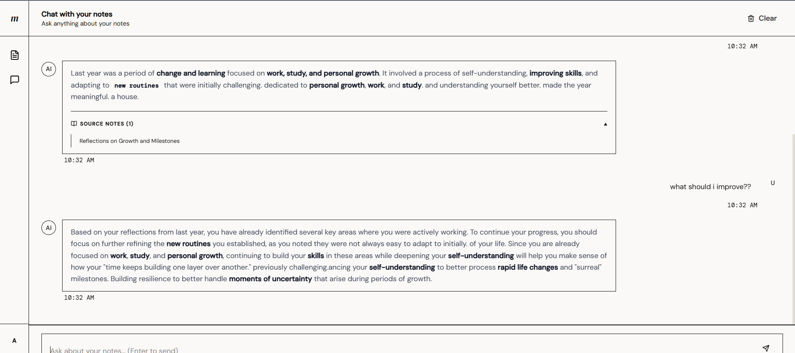

# Mnemo Application Walkthrough

This document provides a visual overview of the Mnemo application flow, illustrating the user experience from login to intelligent note interaction.

---

### Step 1: Secure Login

You can login via [mnemo.ardial.my.id](https://mnemo.ardial.my.id). This is the login page where you can enter your credentials if you already have an account. If you don't already have an account, please proceed to **Step 2** to register.

---

### Step 2: Simple Registration

This is the registration page where you start building your **AI-powered second brain**. To create an account, you will need to provide:
- **Username**: Your unique login handle.
- **Email**: A valid email address.
- **Password**: At least 8 characters for account security.
- **Confirm Password**: To verify your entry.

The minimalist design includes an inspiring quote: *"The palest ink is better than the best memory."* If you already have an account, the link at the bottom takes you back to the sign-in page.

---

### Step 3: Home Dashboard

The Home Dashboard is your command center. Notice the filter options like **Last Week**, **Last Month**, and **Last Year**. 

**Important Note on Filtering**:
These filters do not refer to the creation date of the note. Instead, they filter based on the **event date** extracted from the note's content. This is powered by **Gemini AI with a specialized parser** that identifies what happened to the writer in time, rather than just when they happened to type it.

---

### Step 4: AI Content Generation

Need inspiration? Use the "Auto-Generate" feature to have the AI draft a creative note for you instantly. This is a great way to see how the system handles different types of content.

---

### Step 5: AI Analysis & Metadata

To generate the summary, tags, and sentiment analysis shown here, simply click the **Analyze** button.
> [!NOTE]
> This process is not automatic to save on tokens and allow you to choose which notes get the full AI treatment. Once analyzed, Mnemo stores these insights as persistent metadata.

---

### Step 6: Rich Text Note Creation

Write or edit your notes using our professional rich-text editor. 
- **Flexibility**: You can also write content using other AI tools (like **ChatGPT**) and paste it here to leverage Mnemo's unique RAG search and event-tracking specialized for your personal history.

---

### Step 7: Context-Aware Search

The Chat Feature is where your notes come to life. Start by asking a question. The system will immediately begin a semantic search to "remember" what you've written.

---

### Step 8: AI Retrieval (RAG) & Specificity

Mnemo retrieves the most relevant chunks of text to ground the AI's response in reality. 
> [!IMPORTANT]
> Because we operate on limited infrastructure, **specificity is key**. To get the best results, try to be more specific in your questions (e.g., mention names, specific places, or timeframes) to help the AI pinpoint the exact context in your database.

---

### Step 9: Intelligent Dialogue & Follow-up

Once the context is found, you can have a natural dialogue. You can ask **follow-up questions** about anything — as long as it is based on your notes, the AI will be able to synthesize an answer and keep the conversation going!

---

## Technical Process Under the Hood

Every action shown above is tracked in real-time by our **Loguru-powered educational logging system**. You can see the backend orchestration in your terminal:
- **AUTH**: Tracks login success and secure session initialization.
- **VEC**: Shows vector generation and cosine similarity search.
- **AI**: Details the chain execution for extraction and chat.
- **DB**: Logs persistence and metadata updates.
